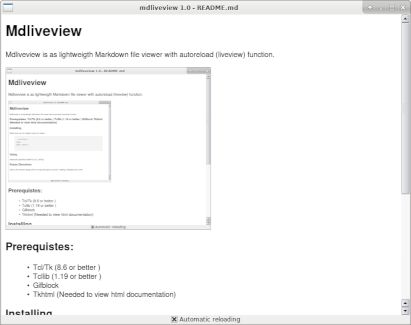

Mdliveview
===

Mdliveview is as lightweigth Markdown file viewer with autoreload (liveview) function.

## Prerequistes:

-  Tcl/Tk      (8.6 or better )
-  Tcllib      (1.19 or better )
-  [Gifblock](https://github.com/Geballin/Gifblock)
-  Tkhtml

## Installing

Mdliveview can be installed using the classic :

    ./configure
    make
    make install

## Using

    mdliveview [MARKDOWN_FILE_TO_OPEN]

## Future Directions

- Making the links working.
- Open a file chooser dialog when no argument given at launch.
- Adding a desktop menu entry.
